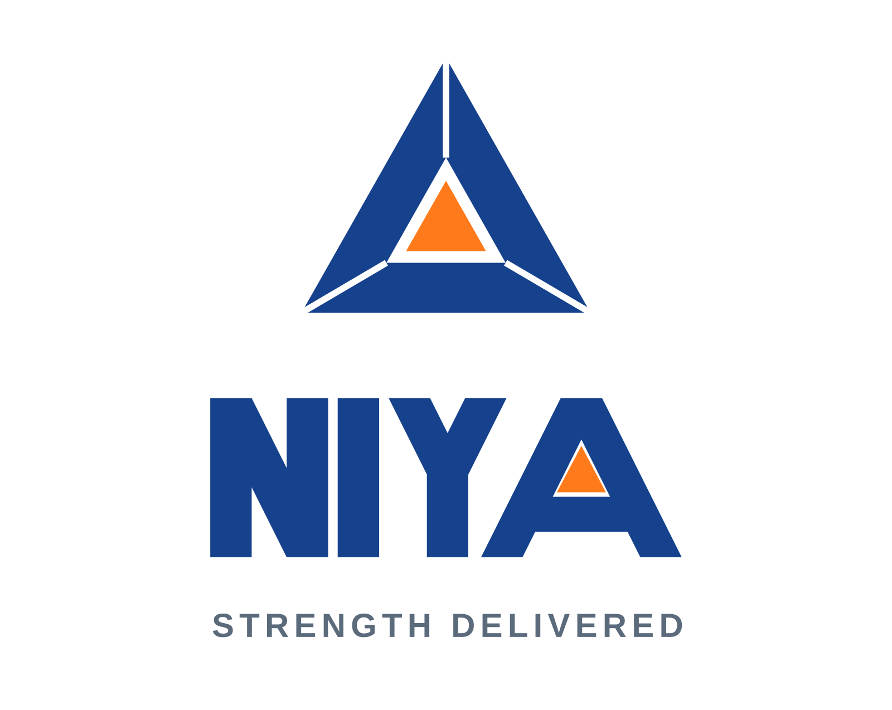

# NIYA — Brand Identity

Corporate identity for **NIYA**, a construction materials company:
Ready Mix Concrete (RMC), concrete blocks, aggregates, construction
materials and infrastructure supply.

**Tagline: STRENGTH DELIVERED**



## Design concept — "The Delta Standard" (v5, built from scratch)

The mark is an **equilateral triangle assembled from three mitred
beams, locked around an orange core**:

| Element | Meaning |
| --- | --- |
| The triangle | The strongest form in structural engineering |
| Three jointed beams | The three product lines: concrete, blocks, aggregates |
| Orange core | Strength, delivered — the promise at the centre |

The custom letterforms are drawn on a **single 1:2 diagonal grid** —
every diagonal in N, Y and A sits at the same angle. The **A of NIYA is
itself a triangle carrying the same orange core as its counter**, so the
mark and the name share one geometry (the principle behind classic
Indian industrial identities like SAIL and HDFC: one geometric idea,
unified across symbol and type).

Earlier explorations are preserved in `logos/concepts/`,
`logos/iterations/` and `archive/`.

## Custom letterforms

N, I, Y, A drawn as vector polygons: cap 100, stroke 26, unified 1:2
diagonals, optical Y–A kerning. No font is used anywhere in the logo.

## Color palette

| Role | Name | Hex |
| --- | --- | --- |
| Primary | Engineering Blue | `#16418C` |
| Secondary | Safety Orange | `#FF7A1A` |
| Support | Steel | `#5B6B7C` |
| Single-colour | Ink | `#101418` |
| Background | White | `#FFFFFF` |

## Files

All masters are scalable SVG (`logos/svg`, `mockups/svg`); PNG renders are
provided for quick use (`logos/png`, `mockups/png`). The previous concept
iteration is kept in `archive/v1-concept` for comparison.

| File | Use |
| --- | --- |
| `niya-logo-primary` | Main corporate logo (icon above wordmark) |
| `niya-logo-horizontal` | Letterheads, website header, invoices, truck doors |
| `niya-logo-monogram` | Stand-alone N mark — helmets, favicons, watermarks |
| `niya-app-icon` | Mobile app / social media avatar (rounded square) |
| `niya-logo-emblem` | Premium circular emblem — seals, uniforms, badges |
| `niya-logo-primary-bw` / `-horizontal-bw` / `-monogram-bw` | Single-color print, stamps, engraving |
| `niya-logo-primary-reversed` | Dark backgrounds (deep blue) |
| `mockups/…truck-branding` | RMC mixer truck livery concept |
| `mockups/…factory-signboard` | Factory fascia signboard concept |
| `mockups/…business-card` | Business card concept, front & back (contact details are placeholders) |

## Usage rules

- **Clear space:** keep a margin equal to the foundation slab's height ×3
  around the logo on all sides.
- **Minimum sizes:** monogram 24 px, horizontal lockup 110 px wide.
- On photographs or colored surfaces use the reversed or B/W version —
  never recolor the mark outside the palette above.
- Don't rotate, outline, add shadows/gradients, or change the proportions
  between icon and wordmark.

## Rebuilding

Everything is generated from one script:

```bash
pip install fonttools cairosvg
python3 tools/build_logos.py
```
