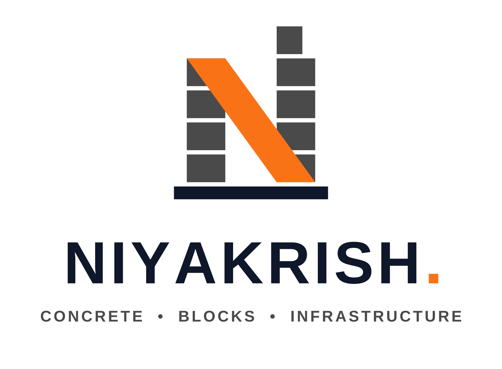

# Niyakrish — Brand Identity

Corporate logo system for **Niyakrish**, a construction materials company:
Ready Mix Concrete (RMC), concrete blocks, paver blocks, construction
materials and infrastructure supply.



## Design concept

The mark is a letter **N** engineered from the company's own products:

| Element | Meaning |
| --- | --- |
| Two columns of stacked blocks (white mortar joints) | Concrete blocks, paver manufacturing, industrial scale |
| Orange structural diagonal beam | Engineering excellence, load-bearing strength |
| Stepped tower top on the right column | Skyline / modern infrastructure development, growth |
| Deep blue foundation slab | Solid foundations, durability, trust |

The geometry is built on a strict grid with no gradients or decorative
detail, so the mark stays crisp from a favicon to a factory signboard, and
remains fully recognizable in a single color.

## Color palette

| Role | Name | Hex |
| --- | --- | --- |
| Primary | Concrete Grey | `#4A4A4A` |
| Secondary | Construction Orange | `#F97316` |
| Accent | Deep Blue | `#0F172A` |
| Background | White | `#FFFFFF` |

## Typography

Wordmark and tagline are set in a bold industrial sans-serif
(Liberation Sans Bold) with wide tracking, **converted to vector
outlines** — no fonts are required to reproduce any file. The orange
block "full stop" after NIYAKRISH is part of the wordmark: a concrete
block as the brand's signature.

## Files

All masters are scalable SVG (`logos/svg`, `mockups/svg`); PNG renders are
provided for quick use (`logos/png`, `mockups/png`).

| File | Use |
| --- | --- |
| `niyakrish-logo-primary` | Main corporate logo (icon above wordmark) |
| `niyakrish-logo-horizontal` | Letterheads, website header, truck doors, invoices |
| `niyakrish-logo-monogram` | Stand-alone N mark — helmets, favicons, watermarks |
| `niyakrish-app-icon` | Mobile app / social media avatar (rounded square) |
| `niyakrish-logo-emblem` | Premium circular emblem — seals, uniforms, badges |
| `niyakrish-logo-primary-bw` / `-horizontal-bw` / `-monogram-bw` | Single-color print, stamps, engraving |
| `niyakrish-logo-primary-reversed` | Dark backgrounds (deep blue) |
| `mockups/…truck-branding` | RMC mixer truck livery concept |
| `mockups/…factory-signboard` | Factory fascia signboard concept |
| `mockups/…business-card` | Business card concept, front & back (contact details are placeholders) |

## Usage rules

- **Clear space:** keep a margin of one block course (the height of one
  brick in the icon) around the logo on all sides.
- **Minimum sizes:** monogram 24 px, horizontal lockup 120 px wide.
- On photographs or colored surfaces use the reversed or B/W version —
  never recolor the mark outside the palette above.
- Don't rotate, outline, add shadows/gradients, or change the proportions
  between icon and wordmark.

## Rebuilding

Everything is generated from one script:

```bash
pip install fonttools cairosvg
python3 tools/build_logos.py
```
